# ERD (Entity Relationship Diagram)

```mermaid
erDiagram

    user {
        bigint id PK
        varchar provider "NOT NULL"
        varchar provider_user_id "NOT NULL"
        varchar email
        varchar nickname "NOT NULL"
        varchar profile_image_url
        varchar role "NOT NULL"
        bigint created_by_id
        datetime created_at "NOT NULL"
        bigint updated_by_id
        datetime updated_at "NOT NULL"
    }

    camp_site {
        bigint id PK
        varchar name "NOT NULL"
        varchar link
        varchar region_code "NOT NULL"
        varchar district_code "NOT NULL"
        time check_in_time "NOT NULL"
        time check_out_time "NOT NULL"
        bigint created_by_id
        datetime created_at "NOT NULL"
        bigint updated_by_id
        datetime updated_at "NOT NULL"
    }

    camping_fam {
        bigint id PK
        varchar name "NOT NULL"
        bigint camp_site_id FK
        varchar reservation_sites "NOT NULL"
        date camping_start_date
        date camping_end_date
        bigint created_by_id
        datetime created_at "NOT NULL"
        bigint updated_by_id
        datetime updated_at "NOT NULL"
    }

    camping_fam_member {
        bigint id PK
        bigint camping_fam_id FK "NOT NULL, UK"
        bigint user_id FK "NOT NULL, UK"
        varchar role "NOT NULL"
        bigint created_by_id
        datetime created_at "NOT NULL"
        bigint updated_by_id
        datetime updated_at "NOT NULL"
    }

    camping_fam_invitation {
        bigint id PK
        bigint camping_fam_id FK
        bigint inviter_id FK
        varchar email "NOT NULL"
        bigint invited_user_id FK
        varchar token "NOT NULL, UNIQUE"
        varchar status "NOT NULL, DEFAULT PENDING"
        datetime expired_at "NOT NULL"
        bigint created_by_id
        datetime created_at "NOT NULL"
        bigint updated_by_id
        datetime updated_at "NOT NULL"
    }

    camping_fam_schedule_temp {
        bigint id PK
        bigint camping_fam_id FK
        bigint user_id "NOT NULL"
        date selected_date "NOT NULL"
        bigint created_by_id
        datetime created_at "NOT NULL"
        bigint updated_by_id
        datetime updated_at "NOT NULL"
    }

    camping_fam_menu {
        bigint id PK
        bigint camping_fam_id FK
        date camping_date "NOT NULL"
        varchar meal_type "NOT NULL"
        varchar menu
        bigint created_by_id
        datetime created_at "NOT NULL"
        bigint updated_by_id
        datetime updated_at "NOT NULL"
    }

    camping_fam_shopping_category {
        bigint id PK
        bigint camping_fam_id FK
        varchar name "NOT NULL"
        bigint created_by_id
        datetime created_at "NOT NULL"
        bigint updated_by_id
        datetime updated_at "NOT NULL"
    }

    camping_fam_shopping_item {
        bigint id PK
        bigint camping_fam_shopping_category_id FK "NOT NULL"
        varchar name "NOT NULL"
        varchar quantity
        boolean is_purchased "NOT NULL, DEFAULT false"
        varchar memo
        bigint created_by_id
        datetime created_at "NOT NULL"
        bigint updated_by_id
        datetime updated_at "NOT NULL"
    }

    camping_fam_supply {
        bigint id PK
        bigint camping_fam_id FK
        varchar name "NOT NULL"
        bigint created_by_id
        datetime created_at "NOT NULL"
        bigint updated_by_id
        datetime updated_at "NOT NULL"
    }

    camping_fam_supply_assignment {
        bigint id PK
        bigint camping_fam_supply_id FK "NOT NULL, UK"
        bigint camping_fam_member_id FK "NOT NULL, UK"
        bigint user_gear_id FK
        varchar memo
        bigint created_by_id
        datetime created_at "NOT NULL"
        bigint updated_by_id
        datetime updated_at "NOT NULL"
    }

    camping_fam_expense {
        bigint id PK
        bigint camping_fam_id FK
        bigint payer_id FK
        decimal amount "NOT NULL, precision=12"
        varchar item_name "NOT NULL"
        bigint created_by_id
        datetime created_at "NOT NULL"
        bigint updated_by_id
        datetime updated_at "NOT NULL"
    }

    camping_fam_settlement {
        bigint id PK
        bigint camping_fam_expense_id FK "NOT NULL"
        bigint debtor_member_id FK "NOT NULL"
        decimal amount "NOT NULL, precision=12"
        bigint created_by_id
        datetime created_at "NOT NULL"
        bigint updated_by_id
        datetime updated_at "NOT NULL"
    }

    notification {
        bigint id PK
        bigint receiver_id FK
        varchar type "NOT NULL"
        varchar message "NOT NULL"
        bigint reference_id "NOT NULL"
        boolean is_read "NOT NULL, DEFAULT false"
        bigint created_by_id
        datetime created_at "NOT NULL"
        bigint updated_by_id
        datetime updated_at "NOT NULL"
    }

    category {
        bigint id PK
        varchar name "NOT NULL"
        varchar memo
        bigint created_by_id
        datetime created_at "NOT NULL"
        bigint updated_by_id
        datetime updated_at "NOT NULL"
    }

    maker {
        bigint id PK
        varchar name "NOT NULL"
        varchar name_eng
        varchar homepage_url
        bigint created_by_id
        datetime created_at "NOT NULL"
        bigint updated_by_id
        datetime updated_at "NOT NULL"
    }

    gear {
        bigint id PK
        varchar name "NOT NULL"
        varchar link
        varchar image_url
        bigint category_id FK "NOT NULL"
        bigint maker_id FK "NOT NULL"
        varchar memo
        bigint created_by_id
        datetime created_at "NOT NULL"
        bigint updated_by_id
        datetime updated_at "NOT NULL"
    }

    review {
        bigint id PK
        bigint gear_id FK "UK"
        bigint user_id FK "UK"
        int rating "NOT NULL"
        varchar content "NOT NULL"
        varchar status "NOT NULL"
        varchar moderation_reason
        bigint moderated_by FK
        datetime moderated_at
        bigint created_by_id
        datetime created_at "NOT NULL"
        bigint updated_by_id
        datetime updated_at "NOT NULL"
    }

    user_gear {
        bigint id PK
        bigint user_id FK "NOT NULL"
        bigint category_id FK "NOT NULL"
        bigint maker_id FK
        bigint gear_id FK
        varchar name
        varchar memo
        bigint created_by_id
        datetime created_at "NOT NULL"
        bigint updated_by_id
        datetime updated_at "NOT NULL"
    }

    recipe_category {
        bigint id PK
        varchar name "NOT NULL"
        bigint created_by_id
        datetime created_at "NOT NULL"
        bigint updated_by_id
        datetime updated_at "NOT NULL"
    }

    recipe {
        bigint id PK
        varchar name "NOT NULL"
        text ingredients
        text instructions
        bigint recipe_category_id FK "NOT NULL"
        bigint created_by_id
        datetime created_at "NOT NULL"
        bigint updated_by_id
        datetime updated_at "NOT NULL"
    }

    %% ── 캠핑팸 도메인 ──────────────────────────────────────
    camp_site            ||--o{ camping_fam                    : "has"
    camping_fam          ||--o{ camping_fam_member             : "has"
    user                 ||--o{ camping_fam_member             : "joins"

    camping_fam          ||--o{ camping_fam_invitation         : "issues"
    camping_fam_member   ||--o{ camping_fam_invitation         : "invites (inviter)"
    user                 |o--o{ camping_fam_invitation         : "invited_user (nullable)"

    camping_fam          ||--o{ camping_fam_schedule_temp      : "has"

    camping_fam          ||--o{ camping_fam_menu               : "has"

    camping_fam          ||--o{ camping_fam_shopping_category  : "has"
    camping_fam_shopping_category ||--o{ camping_fam_shopping_item : "contains"

    camping_fam          ||--o{ camping_fam_supply             : "needs"
    camping_fam_supply   ||--o{ camping_fam_supply_assignment  : "assigned to"
    camping_fam_member   ||--o{ camping_fam_supply_assignment  : "carries"
    user_gear            |o--o{ camping_fam_supply_assignment  : "linked gear (nullable)"

    camping_fam          ||--o{ camping_fam_expense            : "records"
    camping_fam_member   ||--o{ camping_fam_expense            : "pays"
    camping_fam_expense  ||--o{ camping_fam_settlement         : "settled into"
    camping_fam_member   ||--o{ camping_fam_settlement         : "owes (debtor)"

    %% ── 알림 ────────────────────────────────────────────────
    user                 ||--o{ notification                   : "receives"

    %% ── 장비 도메인 ──────────────────────────────────────────
    category             ||--o{ gear                           : "categorizes"
    maker                ||--o{ gear                           : "makes"
    gear                 ||--o{ review                         : "reviewed in"
    user                 ||--o{ review                         : "writes"

    user                 ||--o{ user_gear                      : "owns"
    category             ||--o{ user_gear                      : "categorizes"
    maker                |o--o{ user_gear                      : "made by (nullable)"
    gear                 |o--o{ user_gear                      : "references (nullable)"

    %% ── 레시피 도메인 ────────────────────────────────────────
    recipe_category      ||--o{ recipe                         : "has"
```

---

## 도메인 요약

| 도메인 | 테이블 |
|---|---|
| 사용자 | `user` |
| 캠핑장 | `camp_site` |
| 캠핑팸 | `camping_fam`, `camping_fam_member`, `camping_fam_invitation`, `camping_fam_schedule_temp` |
| 메뉴 | `camping_fam_menu` |
| 쇼핑 | `camping_fam_shopping_category`, `camping_fam_shopping_item` |
| 준비물 | `camping_fam_supply`, `camping_fam_supply_assignment` |
| 정산 | `camping_fam_expense`, `camping_fam_settlement` |
| 알림 | `notification` |
| 장비 | `category`, `maker`, `gear`, `review`, `user_gear` |
| 레시피 | `recipe_category`, `recipe` |

## 공통 컬럼 (CommonEntity)

모든 테이블에 포함된 Auditing 컬럼:

| 컬럼 | 타입 | 설명 |
|---|---|---|
| `created_by_id` | bigint | 생성자 user ID |
| `created_at` | datetime | 생성 일시 (NOT NULL) |
| `updated_by_id` | bigint | 수정자 user ID |
| `updated_at` | datetime | 수정 일시 (NOT NULL) |
